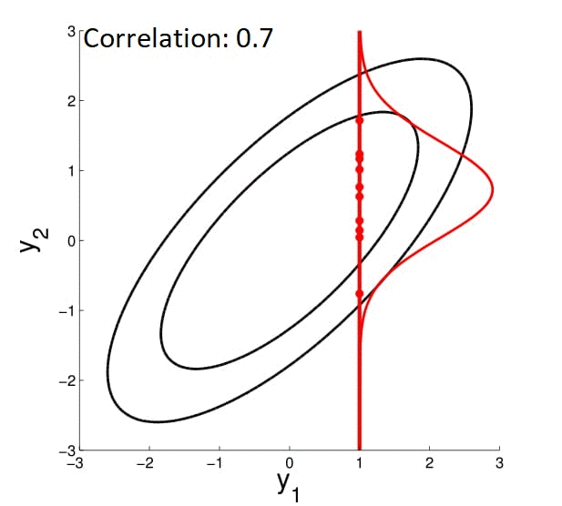

## 开头

回想一下，人们总是对高斯过程（GPs）是一种神奇的算法具有模糊的印象，该算法能够定义函数集上的概率分布，但是我总是拖延阅读细节。不过，这不完全是我的错！每当我使用Google的“高斯过程”时，我都会找到写得很好的教程，这些教程带有生动的图表，可以详细解释所有内容，直到非线性回归为止，但是回避了任何一种信息理论的第一眼。总的来说，关键是

高斯过程是在适合一组点的可能函数上的概率分布。

记住这句话确实有帮助，如果某个陌生的陌生人在街上走近并要求您定义高斯过程（我敢肯定它会一直发生）的话，那么您所做的一切就不会多了。该算法在什么范围内搜索“可能的功能”？是什么赋予它在连续的，无限的空间上对事物建模的能力？

感到困惑的是，我转向了该领域的“书”，卡尔·爱德华·拉斯穆森和克里斯托弗·威廉姆斯的高斯机器学习过程。我的统计学家朋友更喜欢这本书，但是花了半个小时只看了两页关于线性回归的书，我就陷入了生存危机。我敢肯定这是一本好书，但数学却超出了我的水平。

我最终偶然发现了Richard Turner博士在YouTube上所做的上述演讲，这是对GP以及其最新技术的很好的介绍。观看此视频后，阅读《高斯机器学习过程》一书变得容易得多。这些是我从演讲中得到的笔记。我希望他们能够通过阅读一些“傻瓜式机器学习”教程来帮助渴望不仅仅是GP入门的其他人，但是他们还没有准备好接受一本教科书。

## 从非线形回归开始
当然，就像机器学习中的几乎所有内容一样，我们必须从回归开始。 让我们重温这个问题：有人来找您一些数据点（下图中的红色点），而我们想对特定值的值进行一些预测。

